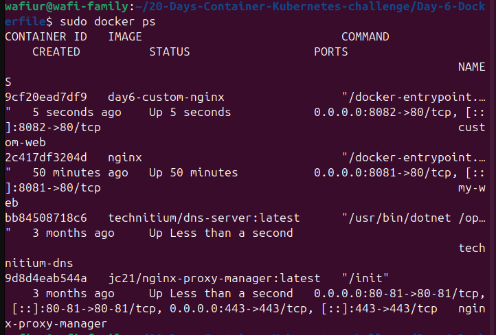
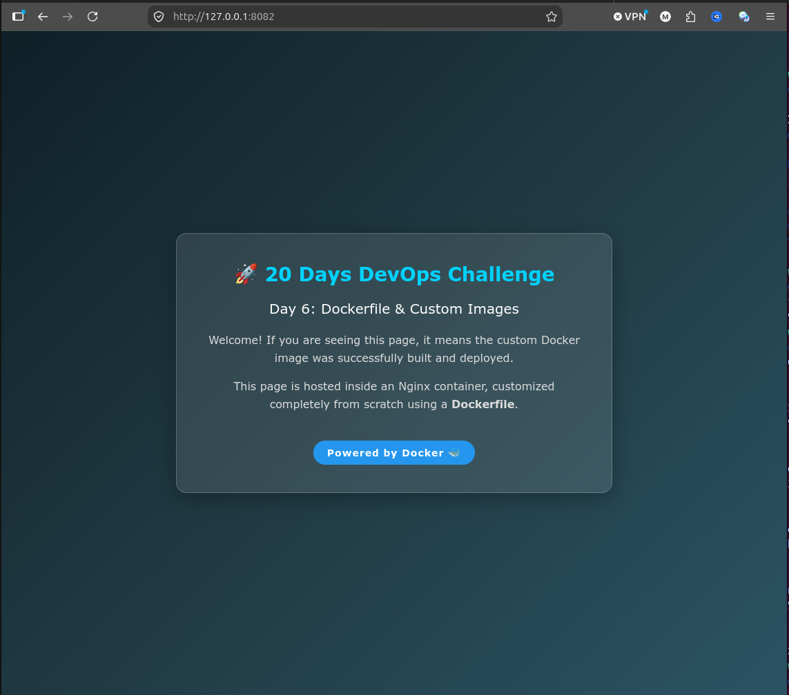

# Day 6: Dockerfile & Custom Images 🐳

Welcome to Day 6 of the **20 Days of Containers & Kubernetes Challenge**!

Today's session focused on writing declarative configurations to build a custom Docker image from scratch. 

## 📋 Workflow & Objectives

### 1. Custom Webpage Creation
Created a custom `index.html` file featuring a modern UI to replace the default Nginx welcome page.

### 2. Writing the Dockerfile
Authored a `Dockerfile` to serve as the blueprint for the custom image.
* **Base Image:** Utilized `nginx:alpine` for a lightweight and secure foundation.
* **Asset Copying:** Used the `COPY` instruction to transfer the local `index.html` into the container's default Nginx hosting directory (`/usr/share/nginx/html/`).
* **Port Exposure:** Declared `EXPOSE 80`.

### 3. Building the Custom Image
Compiled the Dockerfile into a local image using the Docker CLI.
* `sudo docker build -t day6-custom-nginx .`

### 4. Container Deployment
Deployed the newly created custom image in detached mode, mapping it to host port `8082`.
* `sudo docker run -d -p 8082:80 --name custom-web day6-custom-nginx`

## 📸 Practical Output
Below are the outputs of the custom image build process and the web server running successfully:

---
*Day 6 Workflow Completed Successfully!*
