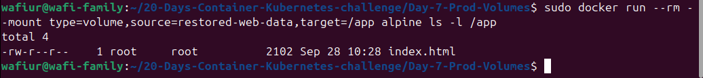
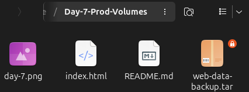

# Day 7: Production-Grade Docker Volumes, Security & Disaster Recovery 🔒🐳

Welcome to Day 7 of the **20 Days of Containers & Kubernetes Challenge**!

Today's session transitioned from basic container deployment to enterprise-level data management. The focus was on persisting stateful data, enforcing strict security using immutable read-only mounts, and implementing a robust backup and restore strategy for disaster recovery.

## 📋 Workflow & Production Best Practices

### 1. Persistent Storage Setup
Created a dedicated Docker volume to manage stateful data independently from the container's ephemeral writable layer.
* `sudo docker volume create prod-web-data`

### 2. Data Seeding via Ephemeral Containers
Avoided using `docker exec` to modify active container data. Instead, used a temporary ephemeral container (`--rm`) to securely copy the local `index.html` UI into the volume before destroying itself.
* `sudo docker run --rm --mount type=bind,source=$(pwd),target=/src --mount type=volume,source=prod-web-data,target=/dest alpine cp /src/index.html /dest/index.html`

### 3. Secure Deployment (Read-Only Mount)
Deployed the Nginx web server using the explicit `--mount` flag and enforced a `readonly` restriction to prevent unauthorized data modification.
* `sudo docker run -d -p 8083:80 --name secure-web --mount type=volume,source=prod-web-data,target=/usr/share/nginx/html,readonly nginx:alpine`

### 4. Security Validation
Attempted to overwrite the `index.html` file directly from inside the running container to simulate a security breach.
* `sudo docker exec secure-web sh -c "echo 'hacked' > /usr/share/nginx/html/index.html"`
* **Result:** Successfully blocked by the OS with a `Read-only file system` error.

### 5. Disaster Recovery: Volume Backup
Created a compressed `.tar` backup of the volume data using a temporary alpine container bound to the host directory.
* `sudo docker run --rm --mount type=volume,source=prod-web-data,target=/data --mount type=bind,source=$(pwd),target=/backup alpine tar -cvf /backup/web-data-backup.tar -C /data .`

### 6. Disaster Recovery: Volume Restore
Simulated a server migration/recovery by creating a new volume (`restored-web-data`) and extracting the data from the `.tar` backup into it.
* `sudo docker volume create restored-web-data`
* `sudo docker run --rm --mount type=volume,source=restored-web-data,target=/data --mount type=bind,source=$(pwd),target=/backup alpine tar -xvf /backup/web-data-backup.tar -C /data`
* **Verification:** `sudo docker run --rm --mount type=volume,source=restored-web-data,target=/app alpine ls -l /app` confirmed the successful restoration of `index.html`.

## 📸 Practical Output
Below are the captured outputs demonstrating the successful volume deployment, blocked security breach, and successful data restoration:

