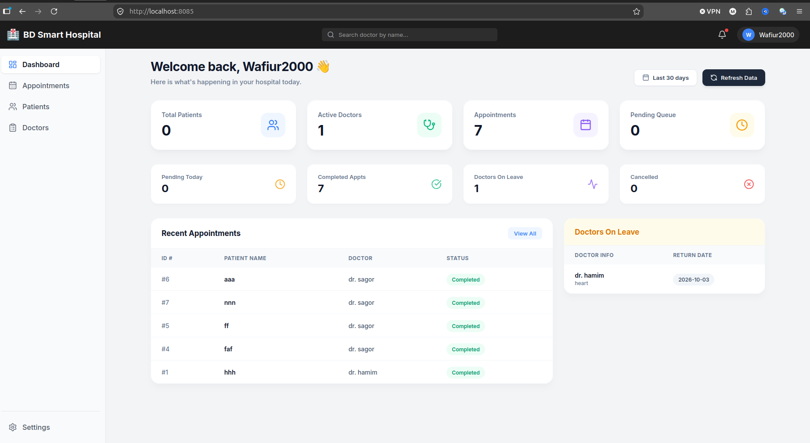

# 🏥 BD Smart Hospital - Enterprise SaaS Dashboard

An enterprise-grade, high-performance Smart Hospital Management SaaS application built with a modern 3D Soft-UI (Neumorphism & Glassmorphism) aesthetic, robust FastAPI backend, and scalable PostgreSQL database.
---

## 🚀 Tech Stack

* **Frontend:** React, React Router, Lucide Icons, Custom 3D Soft-UI / Glassmorphism
* **Backend:** FastAPI, Python, Pydantic, Uvicorn
* **Database:** PostgreSQL
* **Containerization & Testing:** Docker Compose, Locust (Load Testing)

---

## ✨ Key Features

* **3D Modern SaaS UI:** Clean, modern, and high-end interactive dashboard aesthetic.
* **Dynamic Authentication:** Secure login system with live email state sync and password visibility toggles.
* **Patient & Doctor Management:** Real-time doctor queue tracking, status updates (Active/On Leave), and departmental categorization.
* **Appointment Scheduling:** Complete lifecycle tracking from pending queue to completion.
* **High Traffic Load Tested:** Stress-tested using Locust, handling 192+ RPS with 0% failure rate.

---

## 📸 Application Previews

### 1. Enterprise Dashboard (3D Soft-UI)


### 2. Load Testing Results (Locust)


---

## ⚙️ Getting Started (Docker Compose)

1. **Clone the repository:**
   ```bash
   git clone [https://github.com/your-username/bd-smart-hospital.git](https://github.com/your-username/bd-smart-hospital.git)
   cd bd-smart-hospital 

2. **Run the application using Docker Compose:**
```bash
sudo docker compose up --build -d

```


3. **Access the services:**
* **Frontend Dashboard:** `http://localhost:3000`
* **Backend API Docs:** `http://localhost:8000/docs`


