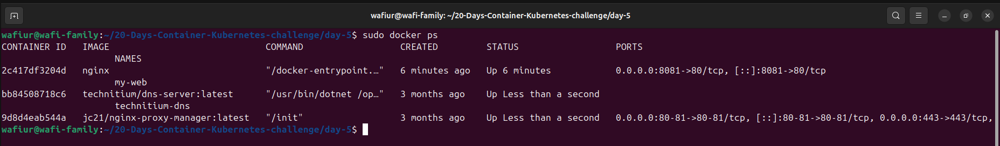

# Day 5: Docker Introduction & Containerization 🐳

Welcome to Day 5 of the **20 Days of Containers & Kubernetes Challenge**!

Today's session focused on the core fundamentals of Docker. 

## 📋 Workflow & Objectives

### 1. Docker Setup & Basics
* Checked Docker version: `docker --version`
* Verified Docker service status: `sudo systemctl status docker`

### 2. Image Pull & Container Run
* Pulled the official Nginx image and ran it in detached mode.
* `sudo docker run -d -p 8081:80 --name my-web nginx`

### 3. Container Management
* Listed running containers to verify status and port bindings.
* `sudo docker ps`

## 📸 Practical Output
Below is the terminal output showing the Nginx container running successfully on port 8081:

